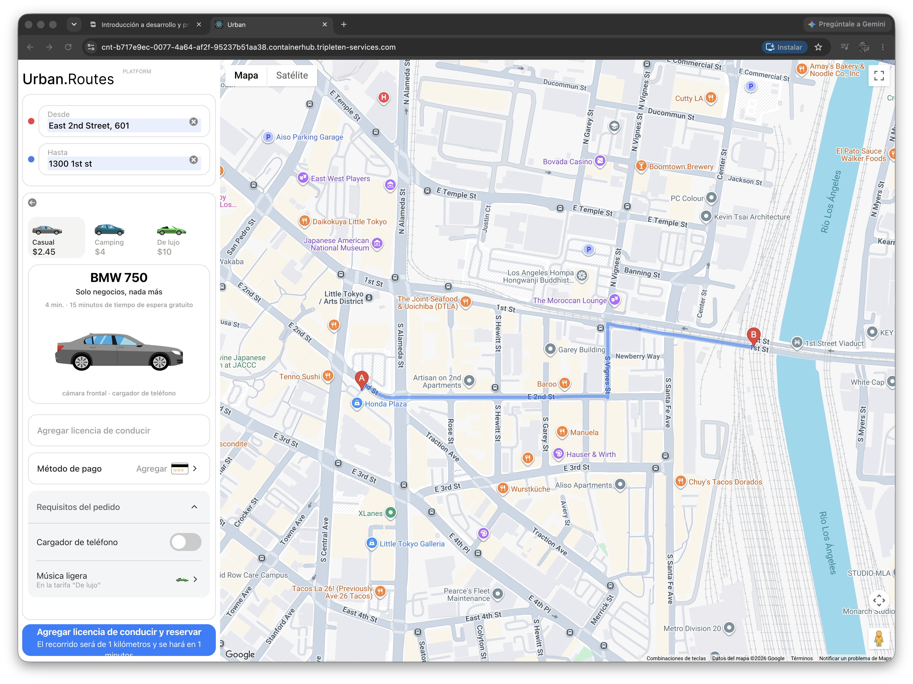
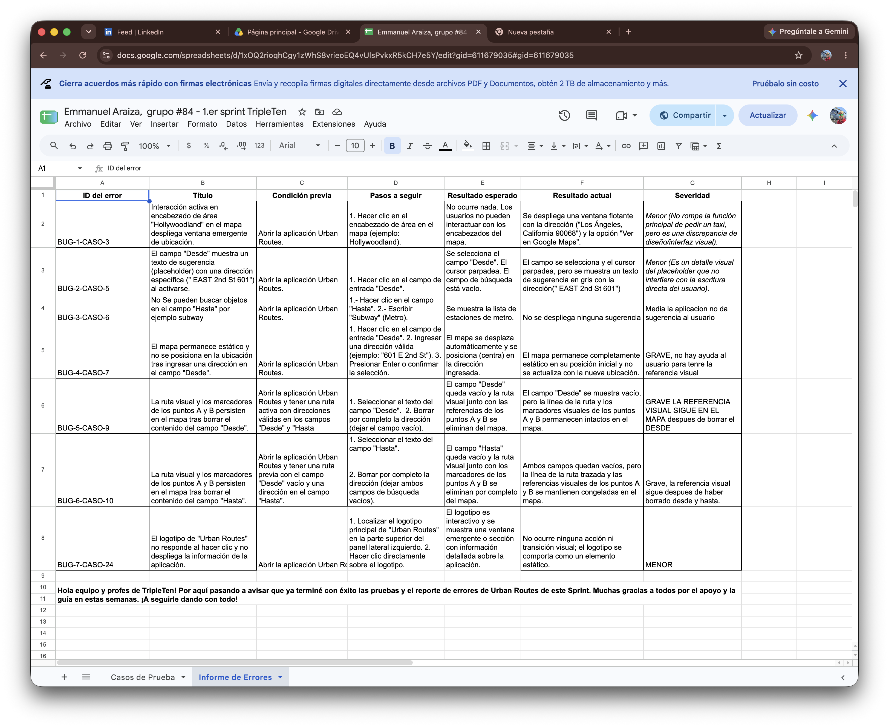

# 🚕 Urban Routes — Manual & Regression Testing

Este repositorio contiene la suite completa de pruebas manuales y de regresión ejecutadas sobre la aplicación web de movilidad **Urban Routes** como parte del programa de Software Quality Assurance de TripleTen.

---

## 🎯 Objetivo del Proyecto

Garantizar la estabilidad y funcionalidad de la plataforma web *Urban Routes* (cálculo de rutas, selección de modos de transporte, interacción con el mapa y tarifas) mediante la aplicación rigurosa del **Ciclo de Vida de Pruebas de Software (STLC)**.

---

## 🛠️ Herramientas y Entorno

* **Aplicación bajo prueba:** Urban Routes (Web Application)
* **Navegador & Inspección:** Google Chrome & DevTools
* **Documentación & Matrices:** Google Sheets
* **Entorno de Pruebas:** Servidor local dedicado

---

## 📊 Resumen de Ejecución de Pruebas

| Artefacto / Métricas | Detalle |
| :--- | :--- |
| **Casos de Prueba Ejecutados** | **23+ Test Cases** (Zoom, Vistas Satélite/Relief/3D, Dirección A/B, Street View) |
| **Estado de Pruebas** | Evaluados como *Aprobado* / *No Aprobado* |
| **Defectos Detectados** | **7 Bug Reports** documentados con severidades asignadas |
| **Técnicas Aplicadas** | Pruebas de Humo (Smoke), Pruebas de Regresión y Exploratorias |

---

## 🐛 Clasificación de Defectos Reportados (Bug Reports)

Los errores encontrados durante la suite de regresión fueron clasificados según su impacto en el sistema:

* **Grave:** Errores donde la función principal del mapa o cálculo no responde o muestra discrepancias visuales críticas (ej. `BUG-4-CASO-7`, `BUG-5-CASO-9`).
* **Media:** Fallos de sugerencia o falta de despliegue en campos de dirección (ej. `BUG-3-CASO-6`).
* **Menor:** Detalles visuales de *placeholders* o textos de sugerencia que no impiden la escritura directa (ej. `BUG-2-CASO-5`).

---

## 📄 Evidencia Técnica e Informes

Puedes consultar la matriz completa de ejecución con todos los casos de prueba y reportes de errores detallados en el siguiente enlace:

---

## ✍️ Autor

**Jehova Emmanuel González Araiza**  
*QA Automation Engineer | Industrial Engineer*  
* [LinkedIn](https://linkedin.com/in/emmanuel-araiza-engineer)
* [GitHub](https://github.com/Emmanuelaraiza90)

---

## 📸 Evidencia Visual de Ejecución

*Interfaz principal de la plataforma web Urban Routes durante la ejecución del plan de pruebas.*

*Evidencia gráfica de desviación identificada durante la suite de regresión.*
